# PatchCore with Explainability
This is an unofficial implementation of the paper [Towards Total Recall in Industrial Anomaly Detection](https://arxiv.org/pdf/2106.08265.pdf).


We measured accuracy and speed for percentage_coreset=0.01, 0.1 and 0.25.

This code was implimented with [patchcore-inspection](https://github.com/amazon-science/patchcore-inspection), thanks.

## Prerequisites

- faiss-gpu (easy to install with conda : [ref](https://github.com/facebookresearch/faiss/blob/main/INSTALL.md))
- torch
- torchvision
- numpy
- opencv-python
- scipy
- argparse
- matplotlib
- scikit-learn
- torchinfo
- tqdm


Install prerequisites with:  
```
conda install --file requirements.txt
```

<br/>

Please download [`MVTec AD`](https://www.mvtec.com/company/research/datasets/mvtec-ad/) dataset.

After downloading, place the data as follows:
```
./
├── main.py
└── mvtec_anomaly_detection
    ├── bottle
    ├── cable
    ├── capsule
    ├── carpet
    ├── grid
    ├── hazelnut
    ├── leather
    ├── metal_nut
    ├── pill
    ├── screw
    ├── tile
    ├── toothbrush
    ├── transistor
    ├── wood
    └── zipper
```

<br/>

## Usage

To test **SPADE** on `MVTec AD` dataset:
```
python main.py
```

After running the code above, you can see the ROCAUC results in `result/roc_curve.png`

<br/>

## Results

Below is the implementation result of the test set ROCAUC on the `MVTec AD` dataset.  

### 1. Image-level anomaly detection accuracy (ROCAUC %)

$\%$

| | Paper<br/>\\%_{core}$=0.1 | This Repo<br/>$\\%_{core}$=0.01 | This Repo<br/>$\\%_{core}$=0.1 | This Repo<br/>$\\%_{core}$=0.25 |
| - | - | - | - | - |
| bottle | 100.0 | xxx | xxx | xxx |
| cable | 99.4 | xxx | xxx | xxx |
| capsule | 97.8 | xxx | xxx | xxx |
| carpet | 98.7 | xxx | xxx | xxx |
| grid | 97.9 | xxx | xxx | xxx |
| hazelnut | 100.0 | xxx | xxx | xxx |
| leather | 100.0 | xxx | xxx | xxx |
| metal_nut | 100.0 | xxx | xxx | xxx |
| pill | 96.0 | xxx | xxx | xxx |
| screw | 97.0 | xxx | xxx | xxx |
| tile | 98.9 | xxx | xxx | xxx |
| toothbrush | 99.7 | xxx | xxx | xxx |
| transistor | 100.0 | xxx | xxx | xxx |
| wood | 99.0 | xxx | xxx | xxx |
| zipper | 99.5 | xxx | xxx | xxx |
| Average | 99.0 | xxx | xxx | xxx |

<br/>

### 2. Pixel-level anomaly detection accuracy (ROCAUC %)

| | Paper<br/>\\%_{core}$=0.1 | This Repo<br/>$\\%_{core}$=0.01 | This Repo<br/>$\\%_{core}$=0.1 | This Repo<br/>$\\%_{core}$=0.25 |
| - | - | - | - | - |
| bottle | 98.6 | xxx | xxx | xxx |
| cable | 98.5 | xxx | xxx | xxx |
| capsule | 98.9 | xxx | xxx | xxx |
| carpet | 99.1 | xxx | xxx | xxx |
| grid | 98.7 | xxx | xxx | xxx |
| hazelnut | 98.7 | xxx | xxx | xxx |
| leather | 99.3 | xxx | xxx | xxx |
| metal_nut | 98.4 | xxx | xxx | xxx |
| pill | 97.6 | xxx | xxx | xxx |
| screw | 99.4 | xxx | xxx | xxx |
| tile | 95.9 | xxx | xxx | xxx |
| toothbrush | 98.7 | xxx | xxx | xxx |
| transistor | 98.7 | xxx | xxx | xxx |
| wood | 95.1 | xxx | xxx | xxx |
| zipper | 98.9 | xxx | xxx | xxx |
| Average | 98.1 | xxx | xxx | xxx |

<br/>

### 3. Processing time (sec)

| | Paper<br/>\\%_{core}$=0.1 | This Repo<br/>$\\%_{core}$=0.01 | This Repo<br/>$\\%_{core}$=0.1 | This Repo<br/>$\\%_{core}$=0.25 |
| - | - | - | - | - |
| bottle | - | 6.6 | 7.2 | 16.4 |
| cable | - | 13.2 | 13.2 | 30.1 |
| capsule | - | 11.6 | 11.9 | 25.3 |
| carpet | - | 12.0 | 11.6 | 26.2 |
| grid | - | 7.4 | 7.5 | 17.7 |
| hazelnut | - | 12.4 | 12.3 | 26.4 |
| leather | - | 10.9 | 10.8 | 26.8 |
| metal_nut | - | 8.3 | 8.6 | 23.1 |
| pill | - | 13.2 | 12.7 | 34.1 |
| screw | - | 11.7 | 11.7 | 28.4 |
| tile | - | 10.3 | 9.9 | 22.2 |
| toothbrush | - | 3.7 | 3.6 | 7.9 |
| transistor | - | 9.6 | 9.7 | 17.7 |
| wood | - | 9.9 | 9.4 | 17.8 |
| zipper | - | 11.4 | 11.4 | 26.6 |
| Average | - | 10.1 | 10.1 | 23.1 |

```
CPU : Intel(R) Xeon(R) Gold 6148 CPU @ 2.40GHz
GPU : Tesla V100 SXM2
```

<br/>

### ROC Curve 

- percentage_coreset = 0.01
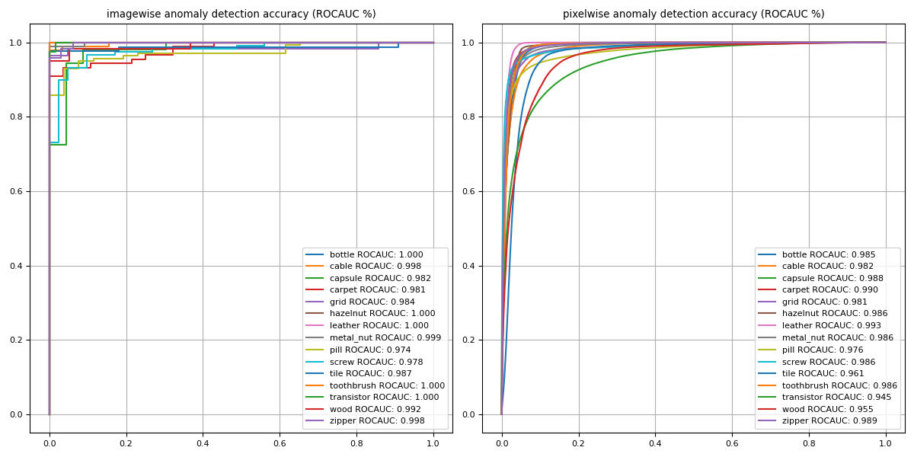

<br/>

- percentage_coreset = 0.1
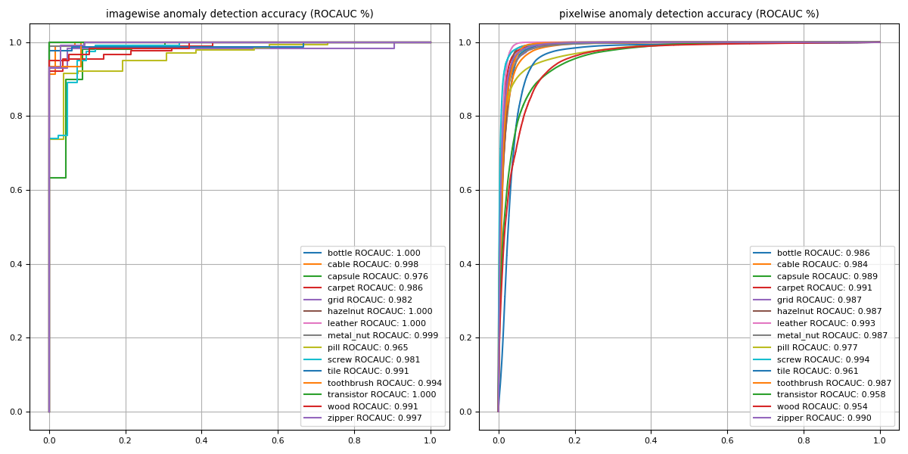

<br/>

- percentage_coreset = 0.25
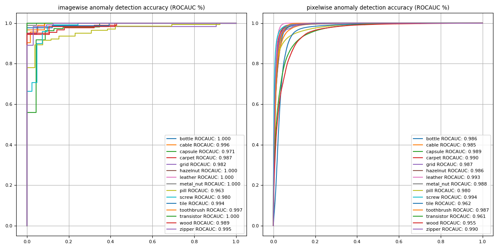

<br/>

### Prediction Distribution (percentage_coreset = 0.1)

- bottle


- cable


- capsule


- carpet


- grid


- hazelnut


- leather


- metal_nut


- pill


- screw


- tile


- toothbrush


- transistor


- wood


- zipper


<br/>

### Localization : percentage_coreset = 0.1

- bottle (test case : broken_large)
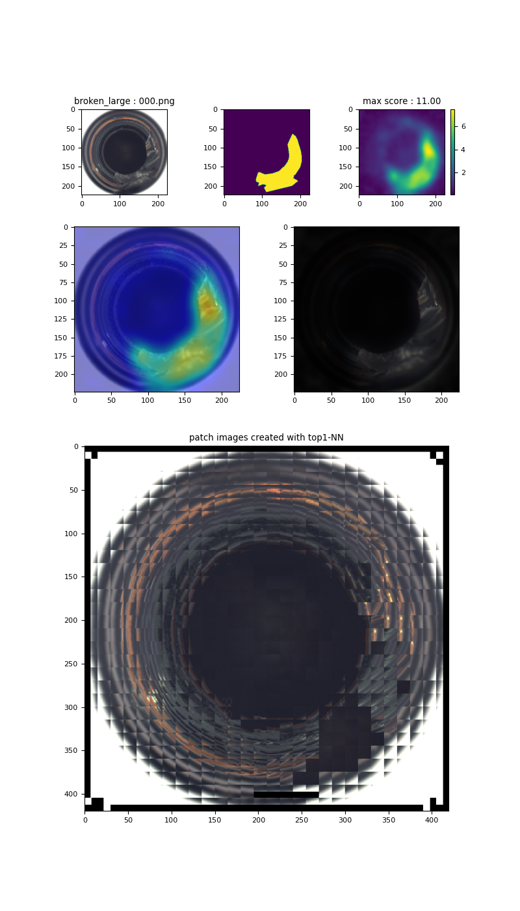

- cable (test case : bent_wire)
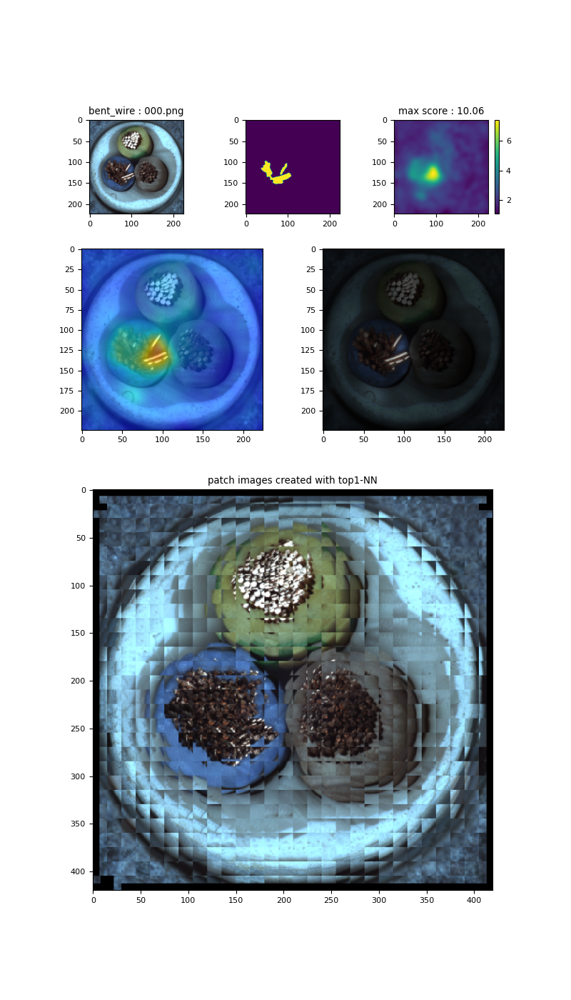

- capsule (test case : crack)
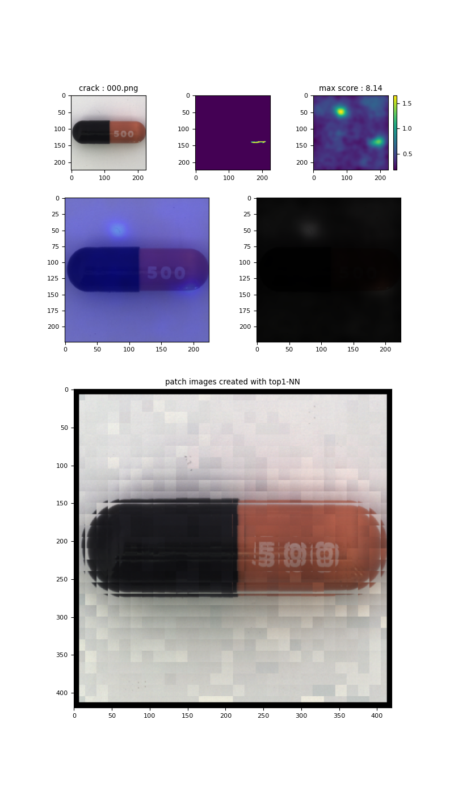

- carpet (test case : color)
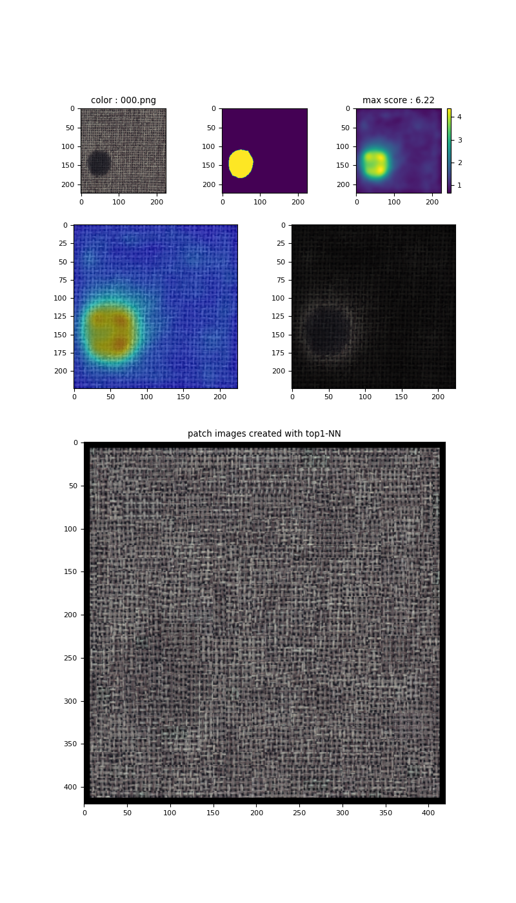

- grid (test case : bent)
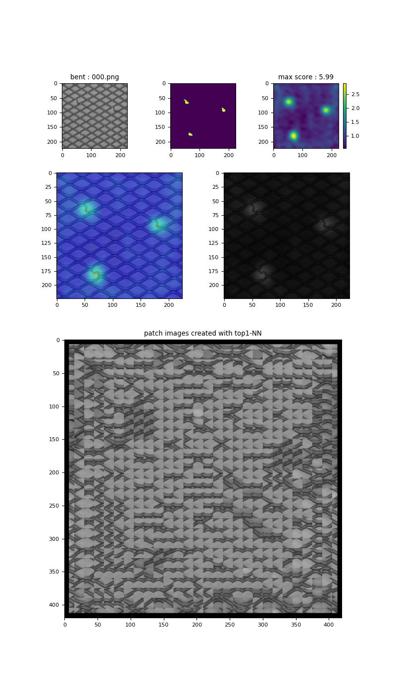

- hazelnut (test case : crack)
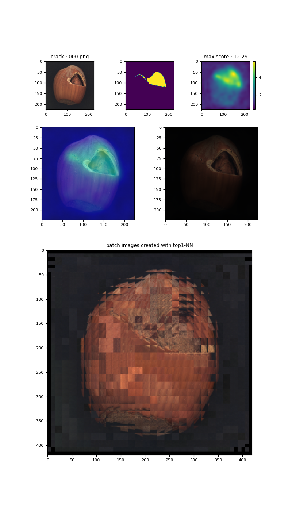

- leather (test case : color)
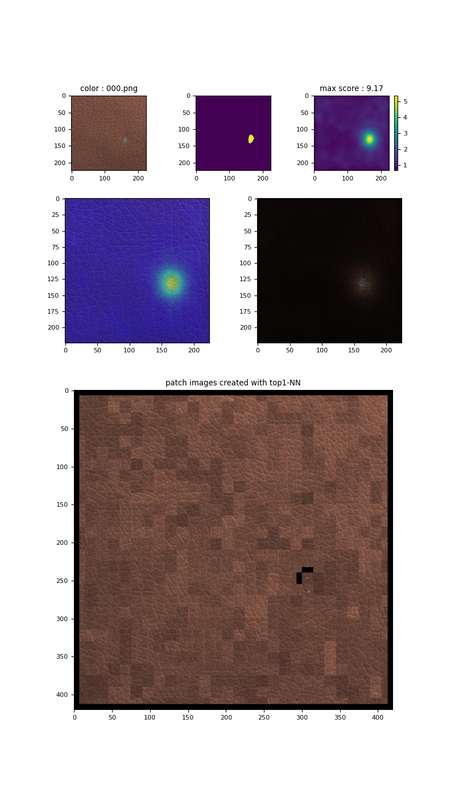

- metal_nut (test case : bent)
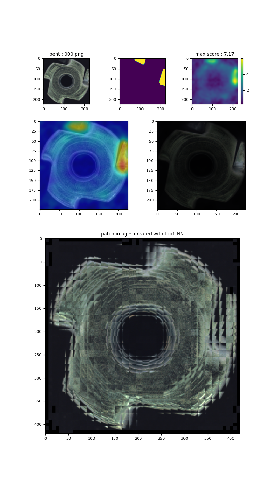

- pill (test case : color)
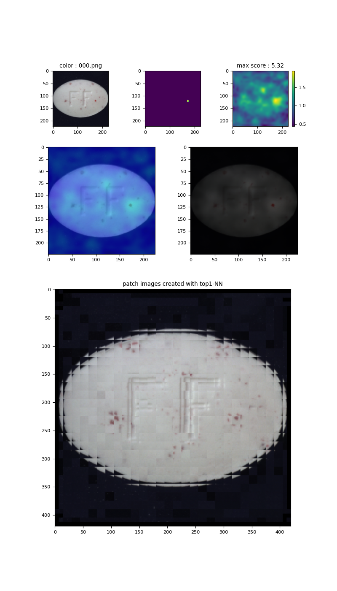

- screw (test case : manipulated_front)
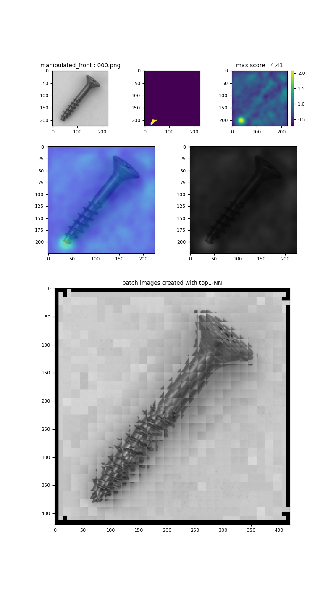

- tile (test case : crack)
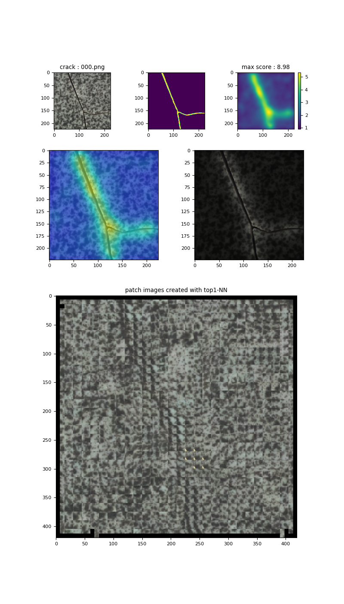

- toothbrush (test case : defective)
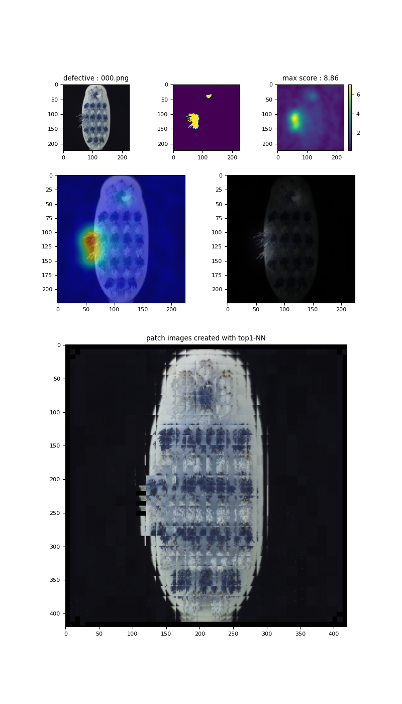

- transistor (test case : bent_lead)
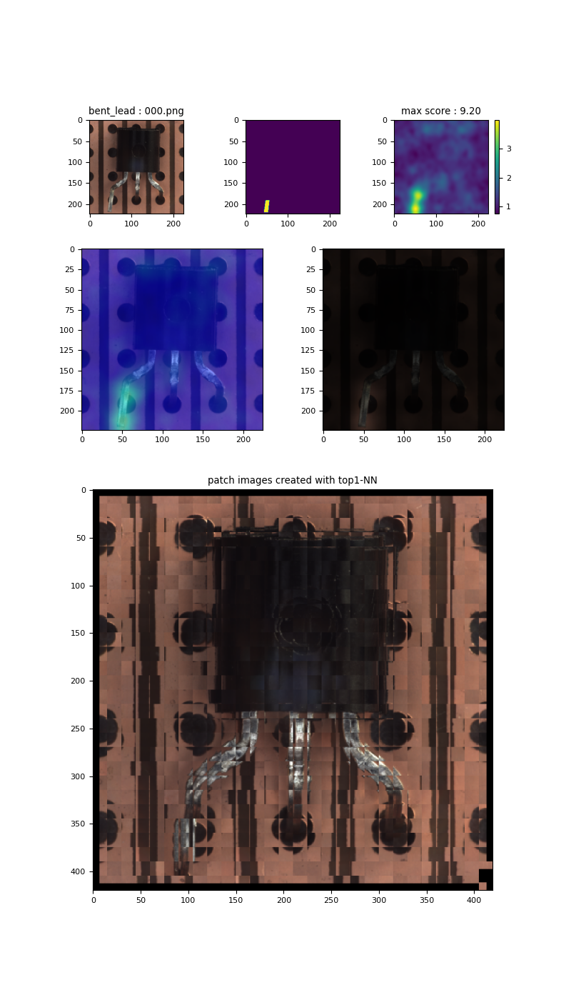

- wood (test case : color)
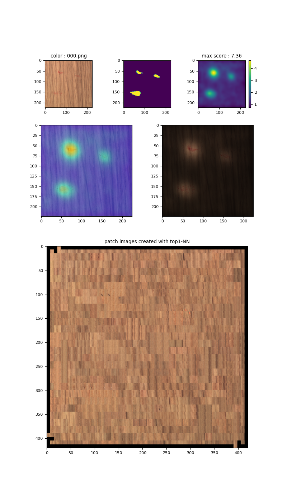

- zipper (test case : broken_teeth)
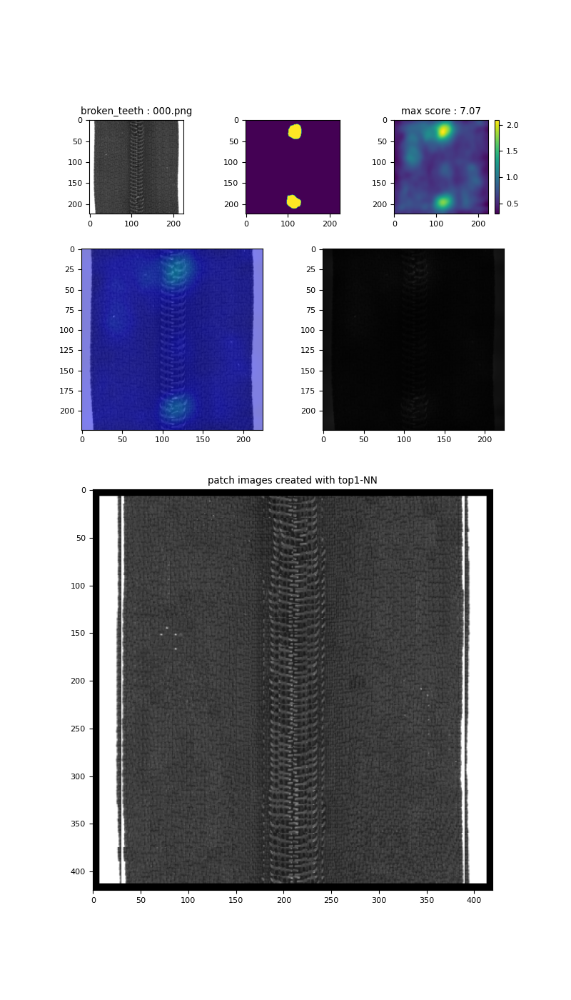


